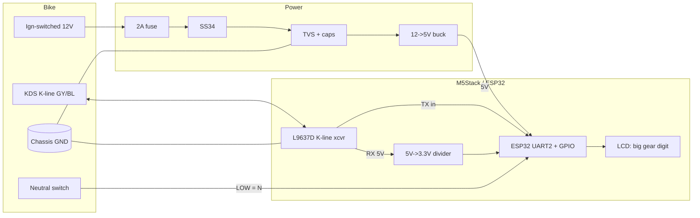

# Wiring & Connector Reference

> ⚠️ All wire colours are a **starting point** from other Kawasaki KDS harnesses.
> **Verify every wire against the W230 service manual and with a multimeter**
> before connecting. The single wire you must positively identify is the K-line
> (idles at battery voltage; briefly toggles during the init handshake).

## KDS 4-pin diagnostic connector

| Pin / wire | Function | Connect to |
|------------|----------|------------|
| GY/BL (grey/blue) | **K-line** (data) | L9637D `K` pin (via 510 Ω pull-up to Vbat) |
| BK/W (black/white) | Ground reference | Module common ground |
| BR/W (brown/white) | Secondary (Vbat / L-line — market dependent) | Leave unless verified |
| LG/BK (light-green/black) | Secondary | Leave unless verified |

## Module connections (M5Stack Core, ESP32)

| ESP32 pin | Direction | Net | Notes |
|-----------|-----------|-----|-------|
| GPIO17 (UART2 TX) | out | → L9637D TX | 3.3 V drives 5 V input directly |
| GPIO16 (UART2 RX) | in | ← L9637D RX via divider | 5.6 k/10 k divider (5 V→3.3 V) |
| GPIO26 | in | Neutral switch | `INPUT_PULLUP`; **LOW = Neutral** |
| GPIO36 (optional) | in | RPM tap (opto) | interrupt-counted pulses |
| GPIO25 (optional) | in | VSS tap (opto) | interrupt-counted pulses |
| 5V IN | power | Buck 5 V out | not from KDS port |
| GND | power | Common single-point ground | tie bike GND + buck GND + logic GND |

> On **M5StickC Plus2**, use G32/G33 for UART2, G25/G26 as available, and G0 for
> the neutral input — adjust `pins.h` accordingly.

## Power tap

```
Ignition-switched 12 V ──[2 A fuse]──[SS34 reverse diode]──┬── P6KE18A TVS ── GND
                                                           ├── 470µF + 100nF ── GND
                                                           └── MP1584 IN
MP1584 OUT (5 V) ── M5Stack 5V IN
MP1584 GND ── common ground
```

## System wiring (mermaid)



## Bring-up checklist

1. Bench-power the buck from a 12 V supply; confirm clean 5 V, correct polarity.
2. Power the M5Stack from the buck; confirm it boots.
3. With the bike **off**, confirm the identified KDS wire idles at battery voltage
   (K-line). Confirm ground continuity to chassis.
4. Connect the transceiver. Key on; run firmware **SCAN/diagnostic** mode.
5. Confirm the init handshake succeeds and RPM tracks throttle blips.
6. Find/confirm the gear register (see `docs/01` §4). Record it in
   `firmware/src/kds_registers.h`.
7. Verify neutral input reads LOW only in neutral.
8. Calibrate the ratio fallback on a short ride (see `docs/03`).
